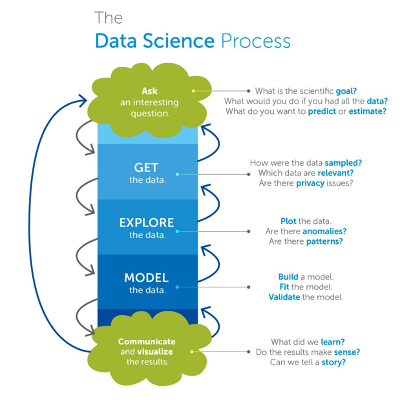

The Data Science Process:

Programming Languages
- Python
- R
- SQL

Processing Tools
- Analytics/ Statistical
    - SAS
    - SPSS
- Big Data
    - Hadoop
    - Hive
    - Pig

Visualisation Tools
- Google Chart
- Tableau

## Ethical Issues
- How much data can be collected without impeding privacy?
    - Your phone knows where you are
    - Google home can always hear you

## Issues with data analysis 
- Economic: University admissions
- Medical: Health insurance
- Legal: Retrospective policing
- E.g. What if your health insurance company could use your relatives DNA profile from a genealogy
  site to decide whether to insure you
