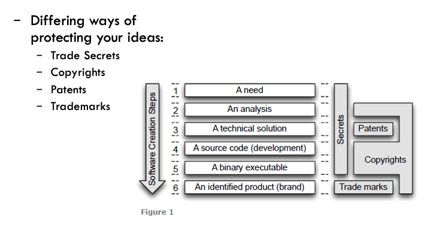

Intellectual Property in Technology: The ownership of ideas and control over the tangible or virtual
representation of those ideas. Use of another person's intellectual property may or may not involve
royalty payments or permission, but should always include proper credit to the source.

14$^{th}$C: Letters Patent
    - Issued by Monarch to establish some rights

1624: Statute of Monopolies
    - Addressed the "patent" system already in place
    - Preserved patents for "novel inventions"

1710: Statute of Anne (aka Copyright Act)
    - 1662: Licensing of the Press Act: gave the authority to print literary works to *The
      Stationer's Company* (Printers guild). Led to censorship
    - Copyright Act moved the authority to the author of a work for a period of 14 or 28 years

## Who owns the copyright?
Painted Portraits → Person who commissioned the work
Commissioned Photographs → Photographer
    - If the photos are of a private or domestic nature, the commissioning party owns copyright
Films → The person who made it
    - Maker is the person who undertook the arrangements necessary for the making of the film
    - For live performances, the actors could be considered makers
Commissioned Films → Commissioning party

## Software Copyright
Software is protected as a literary work
Ownership is determined by:
- Any agreement that is in place
- If created as an employee in the course of employment → the employer
- Otherwise → the creator of the software (generally the developer/s who wrote the code).

## How to protect your ideas

## Rights of copyright owner
- Reproduce the software
- Publish the software
- Adapt the software
- Communicate the software to the public

## Free use exceptions
- Fair dealing (parodies, research, criticism or review)
- Flexible dealing (use in teaching)
- Educational Exceptions (classroom demonstrations)
- Back-up copies

Once you have ownership of the software Intellectual property, you allow others to use it through
license agreements
- Proprietary
    - EULA: End-User License Agreement ("Licensed not sold")
- FOSS (Free and open source software)

Variation in rights granted:
- Right to use / copy / modify / distribute / sublicense
