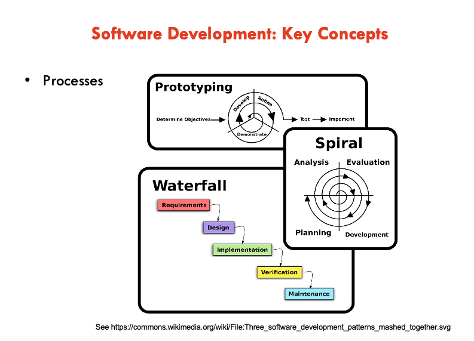

Famous software failures
- Therac-25
- Ariane-5
- HeartBleed
- NorthEast Blackout
- Denver Airport Baggage Handling

Software development types:

## Key Concepts
- Requirements / Analysis / Specifications
- Design
- Testing / Verification / Validation
